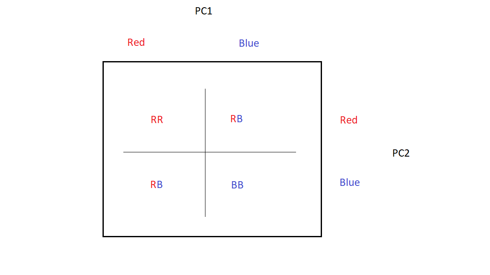

```{r, echo=TRUE, results="hide", message=FALSE, warning=FALSE, eval=TRUE}
knitr::opts_chunk$set(echo = TRUE)

## Load libraries
library(rlang)
library(stringr)
library(data.table)
library(DT)
library(dplyr)
suppressMessages( library("DESeq2") )
library(ggplot2)
suppressMessages( library( EnhancedVolcano ) )
library(pheatmap)
library(PoiClaClu)
library(RColorBrewer)


# Barretts
# from https://jhubiostatistics.shinyapps.io/recount/
# 'IL-1ß and SERPINA3 are markers of an aggressive Barretts Oesophagus phenotype identified using mRNA sequencing'
study <- "Barretts"

```

```{r, echo=TRUE, results="hide", message=FALSE, warning=FALSE, eval=params$recompile}
knitr::opts_chunk$set(echo = TRUE)

suppressMessages( library("recount") )
suppressMessages( library(org.Hs.eg.db) )
library(EnsDb.Hsapiens.v86)
suppressMessages( library( AnnotationDbi ) )

accession='SRP043694'

## Download the RangedSummarizedExperiment object
url <- download_study(accession)

## Load the data
load(file.path(accession, 'rse_gene.Rdata'))

# truncate the ensemble id version number from the rownames
rownames = rownames( rse_gene )
for(i in 1:length(rownames)){
  rownames[i] <- gsub("\\..*","",rownames[i])
}
rownames( rse_gene ) <- rownames

# truncate also the gene_id column
rowdata=rowData(rse_gene)
rowdata$gene_id = gsub("\\..*","",rowdata$gene_id)
rowData(rse_gene)=rowdata

# use raw counts
rse <- rse_gene


# Simple_intestinal_metaplasia
# High_Grade_Dysplasia
# Low_Grade_Dysplasia
colData(rse) <- as.data.frame(colData(rse)) %>% 
  mutate(cond = substring(lapply(characteristics, `[[`, 1), 22)) %>%
  mutate(cond=str_replace_all(cond, " ", "_")) %>%
  mutate(cond=str_replace_all(cond, "Dsyplasia", "Dysplasia")) %>% # correct typo
  DataFrame

# Barretts - focus on low vs. high dysplasia for now
rse <-
  subset(rse
         , select = colData(rse)$cond %in% 
           c("Simple_intestinal_metaplasia", "High_Grade_Dysplasia"))
  colData(rse) <- as.data.frame(colData(rse)) %>% 
    # rename to Metaplasia vs. Dysplasia
    mutate(cond=str_replace_all(cond, "Simple_intestinal_metaplasia", "Metaplasia")) %>% 
    mutate(cond=str_replace_all(cond, "High_Grade_Dysplasia", "Dysplasia")) %>%
    DataFrame

# convert to factor
rse$cond <- factor(rse$cond)

# Differential Expression analysis
dds <- DESeqDataSet(rse, design = ~ cond)
dds <- DESeq(dds)

res <- results(dds, contrast = c("cond"
                                 , "Dysplasia"
                                 , "Metaplasia")) 

# sort by padj
res <- res[with(res, order(padj)), ]

# set up differentially expressed gene selection criteria 
pThr        <- 0.01   # for adj. p-value threshold (<= 0.01)
logFCThr    <- 1      # for log2 fold-change (at least 2 fold)
baseMeanThr <- 30     # for average expression level (at least 30 counts).

# annotate sigRes (org.Hs.eg.db)
library(EnsDb.Hsapiens.v86)
anno <- ensembldb::select(
  EnsDb.Hsapiens.v86, 
  filter = GeneIdFilter("ENS", "startsWith"),
  keys = rownames( res ), 
  keytype = "GENEID", 
  columns = c("SYMBOL","GENEID","GENENAME"))

res = cbind( ENSEMBL = rownames( res), res )
outTable <- left_join( as.data.frame( res ), anno, by = c("ENSEMBL" = "GENEID") )

# significant genes
idx = which( outTable$padj <= pThr 
             & abs( outTable$log2FoldChange ) >= logFCThr 
             & outTable$baseMean >= baseMeanThr 
)
sigRes = outTable[idx, ]

# significant genes (upregulated)
idx = which( outTable$padj <= pThr 
             & abs( outTable$log2FoldChange ) >= logFCThr 
             & outTable$log2FoldChange >= 0 
             & outTable$baseMean >= baseMeanThr 
)
upregulated = outTable[idx, ]

# significant genes (downregulated)
idx = which( outTable$padj <= pThr 
             & abs( outTable$log2FoldChange ) >= logFCThr 
             & outTable$log2FoldChange <= 0 
             & outTable$baseMean >= baseMeanThr 
)
downregulated = outTable[idx, ]


# perform regularized-logarithm transformation (rlog)
#rld <- rlog(dds)
rld <- vst(dds)

save(sigRes, file="sigRes.RData")
save(upregulated, file="upregulated.RData")
save(downregulated, file="downregulated.RData")
save(rld, file="rld.RData")
save(dds, file="dds.RData")

```

In this assignment, we analyze RNA-Seq data from an experiment designed to detect biomarkers for differential outcomes in Barrett's oesophagus (BO). RNA was extracted from 21 patients and diagnosed by GI pathologists into the three histological grades: `Simple intestinal metaplasia` vs. `Low Grade Dysplasia` vs. `High Grade Dysplasia`.    We focus in this analysis in differentially expressed genes in `Simple intestinal metaplasia` vs. `High Grade Dysplasia` which we will refer henceforth as `Metaplasia` and `Dysplasia`.  The data for this assignment was extracted from the Recount2 database and analyzed with the DESeq2 software.

All code for extracting and analyzing this dataset is available in the folded code window button in the top right.  

## Differentially Expressed Genes {.tabset}

We have dropped samples from the dataset with `Low Grade Dysplasia` (7 samples) and compared samples with `High Grade Dysplasia` (7 samples) vs. `Simple_intestinal_metaplasia`(7 samples).  Criteria for thresholding differentially expressed genes are:

+ Absolute Log-2 fold change of at least 1 (at least doubling or halving of gene expression)
+ Adjusted p-value < 0.01
+ Minimum expression level of at least 30 counts

72 genes were up-regulated and 35 genes down-regulated:

### Up-regulated

```{r, echo=FALSE}

load("upregulated.RData")

datatable(setcolorder(
  subset(
    upregulated %>%
      mutate(baseMean = round(baseMean)) %>%
      mutate(padj = signif(padj, 2)) %>%
      mutate(log2FoldChange = round(log2FoldChange, 3))
    , select = c("ENSEMBL", "SYMBOL", "GENENAME", "baseMean", "log2FoldChange", "padj") ),
  c(
    "ENSEMBL",
    "SYMBOL",
    "GENENAME",
    "baseMean",
    "log2FoldChange",
    "padj"
  )
))

```
### Down-regulated

```{r, echo=FALSE}

load("downregulated.RData")

datatable(setcolorder(
  subset(
    downregulated %>%
      mutate(baseMean = round(baseMean)) %>%
      mutate(padj = signif(padj, 2)) %>%
      mutate(log2FoldChange = round(log2FoldChange, 3))
    , select = c("ENSEMBL", "SYMBOL", "GENENAME", "baseMean", "log2FoldChange", "padj") ),
  c(
    "ENSEMBL",
    "SYMBOL",
    "GENENAME",
    "baseMean",
    "log2FoldChange",
    "padj"
  )
))

```

## Principal Components Analysis Plot

In Principal Components Analysis, we search for a small number of orthogonal vectors $v_i$ (in this case two) that approximate as closely as possible the given gene expression matrix $X$:

 $$
 X = \sum_{j=1}^{2} a_jv_j
 $$
The first two principal components capture a total of 57% of the variance in the gene expression:  

```{r , fig.width=8, fig.height=8, fig.fullwidth=TRUE, echo=FALSE}

load("rld.RData")

pca_plot <- plotPCA(rld, intgroup = c("cond"))

library(ggplot2)

pca_plot 
```

### Separation of Metaplasia cs. Dysplasia in PCA

Both the metaplasia samples (blue circles) and dysplasia samples (red circles) run the gamut of PC1 and PC2 values from low to high (that is, the visual separation is not immediately clear).  But if we look at only the left half of the plot (where PC1<0) we find more red than blue, and if we look at the right half of the plot (where PC1>0), we find more blue than red.  Similarly, if we look at the lower half of the plot (where PC2<0), we find more blue than red, and if we look at the upper half of the plot, we find more red than blue.  Knowing the value of a sample's first two principal components allows us to predict whether it is dysplasia vs metaplasia at a better than chance rate:



## Volcano Plot

The Volcano plot allows us to visualize genes along according to their statistical significance (p-value) and their fold change in dysplasia vs. metaplasia:

```{r , fig.width=8, fig.height=8, fig.fullwidth=TRUE, echo=FALSE}

load("sigRes.RData")

volcano_plot <- 
EnhancedVolcano( as.data.frame(sigRes), lab = sigRes$SYMBOL, 
                 x = 'log2FoldChange', y = 'padj'
#                 ,xlim = c(-8, 8), title = ' '
              #   ,pCutoff = 0.01, FCcutoff = 2
)              

volcano_plot 
```

## Heatmap

The Heat map shows the 14 samples' pairwise poisson _dissimilarity_ in gene expression in the shaded blue grid.  On the margins there is a clustering analysis of the 14 samples' gene expression.  The heat map shows a good (but not perfect) separation between dysplasia and metaplasia, since dysplsia samples tend to be clustered with each other and metaplasia samples tend to be clustered with each other: 

```{r , fig.width=8, fig.height=8, fig.fullwidth=TRUE, echo=FALSE}

load("dds.RData")

# plot heatmap of Poisson distances between samples
# use Poisson distance for raw (non-normalized) count data
# use Euclidean distance for data normalized by regularized-logarithm transformation (rlog) or variance stablization transfromation (vst)
poisd <- PoissonDistance(t(counts(dds)))
samplePoisDistMatrix <- as.matrix( poisd$dd)
rownames(samplePoisDistMatrix) <- dds$cond #paste(dds$cond, dds$cell, sep=" - " )
colnames(samplePoisDistMatrix) <- dds$cond #paste(dds$cond, dds$cell, sep=" - " ) #NULL
colors = colorRampPalette( rev(brewer.pal(9, "Blues")) )(255)
heatmap_plot <-
pheatmap(samplePoisDistMatrix,
         clustering_distance_rows = poisd$dd,
         clustering_distance_cols = poisd$dd,
         col = colors)

heatmap_plot
```


## GSEA

